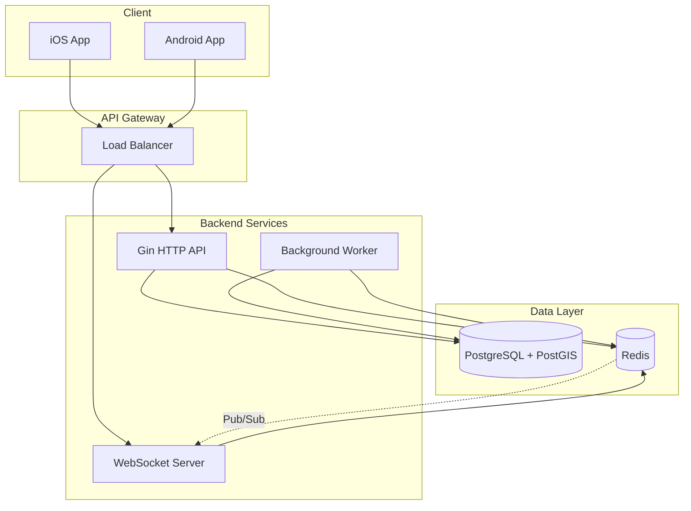

# Design Document: Location Sharing Backend

## Overview

本设计文档描述实时位置共享应用后端的技术架构和实现方案。系统基于 Go + Gin + GORM + PostGIS + Redis 技术栈，支持高并发位置上报、WebSocket 实时推送和地理空间计算。

### 核心技术选型

| 组件 | 技术 | 用途 |
|------|------|------|
| Web框架 | Gin | HTTP API 和 WebSocket |
| ORM | GORM | 数据库操作 |
| 数据库 | PostgreSQL + PostGIS | 地理空间数据存储 |
| 缓存 | Redis | 位置缓存、Pub/Sub |
| 认证 | JWT | 用户认证 |
| 实时通信 | gorilla/websocket | WebSocket 连接 |

## Architecture



### 分层架构

```
├── api/customer/          # API 控制器层
│   ├── location.go        # 位置相关接口
│   ├── friend.go          # 好友相关接口
│   ├── device.go          # 设备相关接口
│   └── websocket.go       # WebSocket 处理
├── service/               # 业务逻辑层
│   ├── location/          # 位置服务
│   ├── friend/            # 好友服务
│   ├── device/            # 设备服务
│   └── notification/      # 通知服务
├── adaptor/repo/          # 数据访问层
│   ├── location/          # 位置仓储
│   ├── friend/            # 好友仓储
│   └── device/            # 设备仓储
└── adaptor/redis/         # Redis 操作层
    ├── cache.go           # 缓存操作
    ├── geo.go             # GEO 命令
    └── pubsub.go          # Pub/Sub
```

## Components and Interfaces

### 1. Location Service Interface

```go
type ILocationService interface {
    // 上报位置
    ReportLocation(ctx context.Context, req *dto.LocationReportReq) error
    // 批量上报位置
    BatchReportLocation(ctx context.Context, req *dto.BatchLocationReportReq) error
    // 获取用户最新位置
    GetUserLocation(ctx context.Context, userID int64) (*dto.LocationResp, error)
    // 获取设备最新位置
    GetDeviceLocation(ctx context.Context, deviceID string) (*dto.LocationResp, error)
    // 获取位置历史
    GetLocationHistory(ctx context.Context, req *dto.LocationHistoryReq) ([]*dto.LocationResp, error)
    // 查询附近好友
    GetNearbyFriends(ctx context.Context, userID int64, radiusMeters float64) ([]*dto.NearbyFriendResp, error)
}
```

### 2. Friend Service Interface

```go
type IFriendService interface {
    // 发送好友请求
    SendFriendRequest(ctx context.Context, userID, targetUserID int64) error
    // 接受好友请求
    AcceptFriendRequest(ctx context.Context, userID, requestID int64) error
    // 拒绝好友请求
    RejectFriendRequest(ctx context.Context, userID, requestID int64) error
    // 获取好友列表
    GetFriendList(ctx context.Context, userID int64) ([]*dto.FriendResp, error)
    // 删除好友
    RemoveFriend(ctx context.Context, userID, friendID int64) error
    // 搜索用户
    SearchUsers(ctx context.Context, userID int64, keyword string) ([]*dto.UserSearchResp, error)
}
```

### 3. Device Service Interface

```go
type IDeviceService interface {
    // 绑定设备
    BindDevice(ctx context.Context, userID int64, deviceID string) error
    // 解绑设备
    UnbindDevice(ctx context.Context, userID int64, deviceID string) error
    // 获取设备列表
    GetDeviceList(ctx context.Context, userID int64) ([]*dto.DeviceResp, error)
    // 更新设备设置
    UpdateDeviceSettings(ctx context.Context, req *dto.DeviceSettingsReq) error
    // 更新设备状态
    UpdateDeviceStatus(ctx context.Context, deviceID string, status *dto.DeviceStatusReq) error
}
```

### 4. WebSocket Hub Interface

```go
type IWebSocketHub interface {
    // 注册连接
    Register(conn *WebSocketConn)
    // 注销连接
    Unregister(conn *WebSocketConn)
    // 订阅实体
    Subscribe(userID int64, entityType string, entityID string)
    // 取消订阅
    Unsubscribe(userID int64, entityType string, entityID string)
    // 广播位置更新
    BroadcastLocationUpdate(entityType string, entityID string, location *dto.LocationResp)
}
```

### 5. Redis Cache Interface

```go
type ILocationCache interface {
    // 设置用户位置
    SetUserLocation(ctx context.Context, userID int64, loc *dto.LocationResp) error
    // 获取用户位置
    GetUserLocation(ctx context.Context, userID int64) (*dto.LocationResp, error)
    // 设置设备位置
    SetDeviceLocation(ctx context.Context, deviceID string, loc *dto.LocationResp) error
    // 获取设备位置
    GetDeviceLocation(ctx context.Context, deviceID string) (*dto.LocationResp, error)
    // GEO 添加位置
    GeoAdd(ctx context.Context, key string, lon, lat float64, member string) error
    // GEO 半径查询
    GeoRadius(ctx context.Context, key string, lon, lat, radiusMeters float64) ([]string, error)
    // 删除缓存
    Delete(ctx context.Context, keys ...string) error
}
```

## Data Models

### 1. User Location Table (PostGIS)

```sql
CREATE TABLE user_locations (
    id BIGSERIAL PRIMARY KEY,
    user_id BIGINT NOT NULL,
    location GEOGRAPHY(POINT, 4326) NOT NULL,
    accuracy FLOAT,
    altitude FLOAT,
    speed FLOAT,
    bearing FLOAT,
    battery_level INT,
    location_mode VARCHAR(20),  -- 'foreground', 'background', 'significant_change'
    is_low_accuracy BOOLEAN DEFAULT FALSE,
    created_at TIMESTAMP WITH TIME ZONE DEFAULT NOW()
);

CREATE INDEX idx_user_locations_user_id ON user_locations(user_id);
CREATE INDEX idx_user_locations_created_at ON user_locations(created_at);
CREATE INDEX idx_user_locations_location ON user_locations USING GIST(location);
```

### 2. Device Location Table (PostGIS)

```sql
CREATE TABLE device_locations (
    id BIGSERIAL PRIMARY KEY,
    device_id VARCHAR(64) NOT NULL,
    location GEOGRAPHY(POINT, 4326) NOT NULL,
    accuracy FLOAT,
    battery_level INT,
    connection_status VARCHAR(20),
    created_at TIMESTAMP WITH TIME ZONE DEFAULT NOW()
);

CREATE INDEX idx_device_locations_device_id ON device_locations(device_id);
CREATE INDEX idx_device_locations_created_at ON device_locations(created_at);
CREATE INDEX idx_device_locations_location ON device_locations USING GIST(location);
```

### 3. Friend Relationship Table

```sql
CREATE TABLE friends (
    id BIGSERIAL PRIMARY KEY,
    user_id BIGINT NOT NULL,
    friend_id BIGINT NOT NULL,
    status VARCHAR(20) NOT NULL,  -- 'pending', 'accepted', 'rejected'
    sharing_status VARCHAR(20) DEFAULT 'sharing',  -- 'sharing', 'paused', 'hidden'
    created_at TIMESTAMP WITH TIME ZONE DEFAULT NOW(),
    updated_at TIMESTAMP WITH TIME ZONE DEFAULT NOW(),
    UNIQUE(user_id, friend_id)
);

CREATE INDEX idx_friends_user_id ON friends(user_id);
CREATE INDEX idx_friends_friend_id ON friends(friend_id);
```

### 4. Device Table

```sql
CREATE TABLE devices (
    id VARCHAR(64) PRIMARY KEY,
    user_id BIGINT NOT NULL,
    name VARCHAR(100),
    type VARCHAR(50),
    battery_level INT,
    connection_status VARCHAR(20) DEFAULT 'unknown',
    notification_enabled BOOLEAN DEFAULT TRUE,
    created_at TIMESTAMP WITH TIME ZONE DEFAULT NOW(),
    updated_at TIMESTAMP WITH TIME ZONE DEFAULT NOW()
);

CREATE INDEX idx_devices_user_id ON devices(user_id);
```

### 5. Geofence Table (PostGIS)

```sql
CREATE TABLE geofences (
    id BIGSERIAL PRIMARY KEY,
    user_id BIGINT NOT NULL,
    name VARCHAR(100) NOT NULL,
    center GEOGRAPHY(POINT, 4326) NOT NULL,
    radius_meters FLOAT NOT NULL,
    notify_on_enter BOOLEAN DEFAULT TRUE,
    notify_on_exit BOOLEAN DEFAULT TRUE,
    is_active BOOLEAN DEFAULT TRUE,
    created_at TIMESTAMP WITH TIME ZONE DEFAULT NOW(),
    updated_at TIMESTAMP WITH TIME ZONE DEFAULT NOW()
);

CREATE INDEX idx_geofences_user_id ON geofences(user_id);
CREATE INDEX idx_geofences_center ON geofences USING GIST(center);
```

### 6. User Settings Table

```sql
CREATE TABLE user_settings (
    user_id BIGINT PRIMARY KEY,
    share_location BOOLEAN DEFAULT TRUE,
    ghost_mode BOOLEAN DEFAULT FALSE,
    smart_alerts BOOLEAN DEFAULT TRUE,
    sos_alerts BOOLEAN DEFAULT TRUE,
    map_style VARCHAR(20) DEFAULT 'dark',
    distance_unit VARCHAR(10) DEFAULT 'km',
    updated_at TIMESTAMP WITH TIME ZONE DEFAULT NOW()
);
```

### Go Model Definitions

```go
// UserLocation 用户位置模型
type UserLocation struct {
    ID            int64     `gorm:"primaryKey;autoIncrement"`
    UserID        int64     `gorm:"not null;index"`
    Longitude     float64   `gorm:"-"` // 从 PostGIS 解析
    Latitude      float64   `gorm:"-"` // 从 PostGIS 解析
    Location      string    `gorm:"type:geography(POINT,4326);not null"`
    Accuracy      float64   `gorm:"type:float"`
    Altitude      float64   `gorm:"type:float"`
    Speed         float64   `gorm:"type:float"`
    Bearing       float64   `gorm:"type:float"`
    BatteryLevel  int       `gorm:"type:int"`
    LocationMode  string    `gorm:"type:varchar(20)"`
    IsLowAccuracy bool      `gorm:"default:false"`
    CreatedAt     time.Time `gorm:"autoCreateTime"`
}

// Friend 好友关系模型
type Friend struct {
    ID            int64     `gorm:"primaryKey;autoIncrement"`
    UserID        int64     `gorm:"not null;index"`
    FriendID      int64     `gorm:"not null;index"`
    Status        string    `gorm:"type:varchar(20);not null"`
    SharingStatus string    `gorm:"type:varchar(20);default:'sharing'"`
    CreatedAt     time.Time `gorm:"autoCreateTime"`
    UpdatedAt     time.Time `gorm:"autoUpdateTime"`
}

// Device 设备模型
type Device struct {
    ID                  string    `gorm:"primaryKey;type:varchar(64)"`
    UserID              int64     `gorm:"not null;index"`
    Name                string    `gorm:"type:varchar(100)"`
    Type                string    `gorm:"type:varchar(50)"`
    BatteryLevel        int       `gorm:"type:int"`
    ConnectionStatus    string    `gorm:"type:varchar(20);default:'unknown'"`
    NotificationEnabled bool      `gorm:"default:true"`
    CreatedAt           time.Time `gorm:"autoCreateTime"`
    UpdatedAt           time.Time `gorm:"autoUpdateTime"`
}

// Geofence 地理围栏模型
type Geofence struct {
    ID            int64     `gorm:"primaryKey;autoIncrement"`
    UserID        int64     `gorm:"not null;index"`
    Name          string    `gorm:"type:varchar(100);not null"`
    CenterLon     float64   `gorm:"-"`
    CenterLat     float64   `gorm:"-"`
    Center        string    `gorm:"type:geography(POINT,4326);not null"`
    RadiusMeters  float64   `gorm:"type:float;not null"`
    NotifyOnEnter bool      `gorm:"default:true"`
    NotifyOnExit  bool      `gorm:"default:true"`
    IsActive      bool      `gorm:"default:true"`
    CreatedAt     time.Time `gorm:"autoCreateTime"`
    UpdatedAt     time.Time `gorm:"autoUpdateTime"`
}

// UserSettings 用户设置模型
type UserSettings struct {
    UserID       int64     `gorm:"primaryKey"`
    ShareLocation bool     `gorm:"default:true"`
    GhostMode    bool      `gorm:"default:false"`
    SmartAlerts  bool      `gorm:"default:true"`
    SOSAlerts    bool      `gorm:"default:true"`
    MapStyle     string    `gorm:"type:varchar(20);default:'dark'"`
    DistanceUnit string    `gorm:"type:varchar(10);default:'km'"`
    UpdatedAt    time.Time `gorm:"autoUpdateTime"`
}
```

## Correctness Properties

*A property is a characteristic or behavior that should hold true across all valid executions of a system-essentially, a formal statement about what the system should do. Properties serve as the bridge between human-readable specifications and machine-verifiable correctness guarantees.*

Based on the prework analysis, the following correctness properties are identified:

### Property 1: User Entity JSON Round-Trip
*For any* valid User entity, serializing to JSON and deserializing back SHALL produce an equivalent entity with all fields preserved.
**Validates: Requirements 1.6**

### Property 2: Friend Entity JSON Round-Trip
*For any* valid Friend entity, serializing to JSON and deserializing back SHALL produce an equivalent entity with all fields preserved.
**Validates: Requirements 2.7**

### Property 3: Device Entity JSON Round-Trip
*For any* valid Device entity, serializing to JSON and deserializing back SHALL produce an equivalent entity with all fields preserved.
**Validates: Requirements 3.6**

### Property 4: Location Entity JSON Round-Trip
*For any* valid Location entity with coordinates, serializing to JSON and deserializing back SHALL produce an equivalent entity with coordinates preserved within floating-point precision.
**Validates: Requirements 4.8**

### Property 5: Geofence Entity JSON Round-Trip
*For any* valid Geofence entity, serializing to JSON and deserializing back SHALL produce an equivalent entity with all fields preserved.
**Validates: Requirements 7.6**

### Property 6: Settings Entity JSON Round-Trip
*For any* valid UserSettings entity, serializing to JSON and deserializing back SHALL produce an equivalent entity with all fields preserved.
**Validates: Requirements 5.6**

### Property 7: Friend Relationship Bidirectionality
*For any* accepted friend relationship between User A and User B, querying A's friends SHALL include B, and querying B's friends SHALL include A.
**Validates: Requirements 2.2**

### Property 8: Friend Removal Completeness
*For any* friend removal operation between User A and User B, after removal, A's friends SHALL NOT include B, and B's friends SHALL NOT include A.
**Validates: Requirements 2.5**

### Property 9: Location Privacy Enforcement
*For any* user with sharing status set to 'paused' or 'hidden', querying their location by any friend SHALL return no location data.
**Validates: Requirements 4.5**

### Property 10: Ghost Mode Privacy
*For any* user with ghost mode enabled, the user SHALL be able to see friends' locations, but friends SHALL NOT be able to see the user's location.
**Validates: Requirements 5.3**

### Property 11: Nearby Friends Spatial Correctness
*For any* nearby friends query with radius R, all returned friends SHALL have distance from query point less than or equal to R meters.
**Validates: Requirements 4.7, 9.7**

### Property 12: Geofence Containment Correctness
*For any* point and circular geofence, the containment check SHALL return true if and only if the distance from point to geofence center is less than or equal to geofence radius.
**Validates: Requirements 11.2**

### Property 13: Distance Calculation Accuracy
*For any* two geographic points, the calculated distance SHALL be within 0.1% of the true geodesic distance.
**Validates: Requirements 11.1**

### Property 14: Cache Consistency
*For any* location update, after the update completes, querying the location SHALL return the updated value (either from cache or database).
**Validates: Requirements 9.3, 9.4**

### Property 15: WebSocket Subscription Filtering
*For any* user subscribed to specific entities, location updates for non-subscribed entities SHALL NOT be pushed to that user's WebSocket connection.
**Validates: Requirements 8.5**

### Property 16: Batch Location Storage Completeness
*For any* batch of N locations submitted, after successful processing, exactly N locations SHALL be stored in the database.
**Validates: Requirements 4.6, 4.1.5**

### Property 17: Low Accuracy Location Marking
*For any* location with accuracy below threshold, the stored location SHALL have is_low_accuracy flag set to true.
**Validates: Requirements 4.1.6**

### Property 18: Device Binding Uniqueness
*For any* device, the device SHALL be bound to at most one user at any time.
**Validates: Requirements 3.1**

## Error Handling

### Error Codes

```go
var (
    // 位置相关错误
    LocationNotFoundErr    = Errno{Code: 12001, Msg: "Location Not Found"}
    LocationExpiredErr     = Errno{Code: 12002, Msg: "Location Data Expired"}
    InvalidCoordinatesErr  = Errno{Code: 12003, Msg: "Invalid Coordinates"}
    
    // 好友相关错误
    FriendNotFoundErr      = Errno{Code: 13001, Msg: "Friend Not Found"}
    FriendRequestExistsErr = Errno{Code: 13002, Msg: "Friend Request Already Exists"}
    AlreadyFriendsErr      = Errno{Code: 13003, Msg: "Already Friends"}
    CannotAddSelfErr       = Errno{Code: 13004, Msg: "Cannot Add Self as Friend"}
    
    // 设备相关错误
    DeviceNotFoundErr      = Errno{Code: 14001, Msg: "Device Not Found"}
    DeviceAlreadyBoundErr  = Errno{Code: 14002, Msg: "Device Already Bound"}
    DeviceNotBoundErr      = Errno{Code: 14003, Msg: "Device Not Bound to User"}
    
    // WebSocket 相关错误
    WSAuthFailedErr        = Errno{Code: 15001, Msg: "WebSocket Authentication Failed"}
    WSConnectionClosedErr  = Errno{Code: 15002, Msg: "WebSocket Connection Closed"}
    
    // 地理围栏相关错误
    GeofenceNotFoundErr    = Errno{Code: 16001, Msg: "Geofence Not Found"}
    InvalidGeofenceErr     = Errno{Code: 16002, Msg: "Invalid Geofence Parameters"}
)
```

### Error Handling Strategy

1. **数据库错误**: 记录日志，返回通用数据库错误
2. **缓存错误**: 降级到数据库查询，记录警告日志
3. **WebSocket 错误**: 尝试重连，超过重试次数后关闭连接
4. **PostGIS 错误**: 验证输入坐标，返回具体错误信息

## Testing Strategy

### Unit Testing

使用 Go 标准测试框架进行单元测试：

```go
func TestLocationService_ReportLocation(t *testing.T) {
    // 测试位置上报
}

func TestFriendService_AcceptFriendRequest(t *testing.T) {
    // 测试好友请求接受
}
```

### Property-Based Testing

使用 `github.com/leanovate/gopter` 进行属性测试：

```go
import (
    "github.com/leanovate/gopter"
    "github.com/leanovate/gopter/gen"
    "github.com/leanovate/gopter/prop"
)

func TestLocationJSONRoundTrip(t *testing.T) {
    properties := gopter.NewProperties(gopter.DefaultTestParameters())
    
    properties.Property("location JSON round-trip", prop.ForAll(
        func(loc Location) bool {
            data, _ := json.Marshal(loc)
            var decoded Location
            json.Unmarshal(data, &decoded)
            return loc.Equals(decoded)
        },
        genLocation(),
    ))
    
    properties.TestingRun(t)
}
```

### Integration Testing

- 使用 Docker Compose 启动 PostgreSQL + PostGIS + Redis
- 测试完整的 API 流程
- 测试 WebSocket 连接和消息推送

### Testing Requirements

- 每个属性测试运行至少 100 次迭代
- 属性测试必须标注对应的 Correctness Property
- 格式: `**Feature: location-sharing-backend, Property {number}: {property_text}**`
